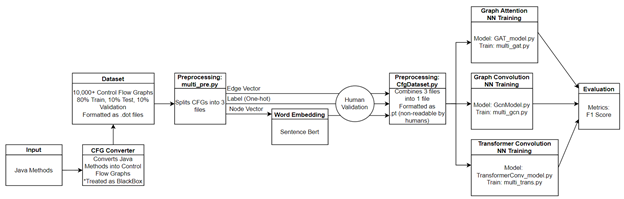

# CS-5542-Project
Vulnerability Detection with Control Flow Graph Convolutional NN

 

This figure shows an abstract representation of our project. 
The input is Java Methods which have been gathered on the web. The CFG converter converts these files into Control Flow Graphs. These 10,000+ CFGs, formatted as .dot files, are our dataset and are split into Training, Testing, and Validation subsets. These CFGs are preprocessed and split into 3 subfiles: the edge file, label file, and node file. The node is then embedded using Sentence Transformer from Bert. Before entering the Graph Neural Networks, they are recombined into a non-readable .pt file. The Graph Attention NN, Graph Convolution NN, and Transformer Convolution NN are built and trained and then evaluated with the validation dataset. Our metric in this project is F1 score. 
